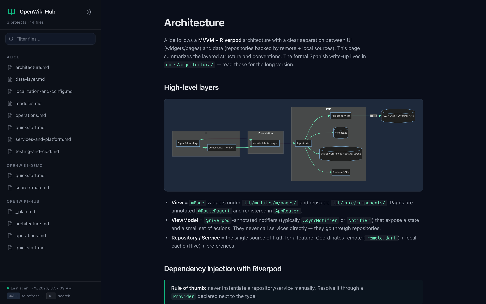

# openwiki-hub

Un visor web unificado para [`openwiki`](https://github.com/langchain-ai/openwiki) — la CLI de LangChain que escribe documentación técnica de tus codebases.

En lugar de saltar de un `openwiki/quickstart.md` a otro entre proyectos, este hub los junta todos en una sola web (`http://localhost:8765`).



## Qué incluye

- **`app/`** — el visor web (HTML + CSS + JS vanilla, sin frameworks, sin build)
  - `index.html` / `styles.css` / `app.js` — la UI
  - `link.sh` — escanea el filesystem, crea symlinks y genera `wikis.json`
- **`templates/`** — los ficheros que `install.sh` copia a tu `~/.openwiki/` y `~/.git-templates/`
- **`install.sh`** — instalador one-shot (idempotente)
- **`uninstall.sh`** — limpia todo lo que el instalador dejó
- **`docs/SETUP.pdf`** — guía en PDF para pasar a otros agentes / PCs

## Quick start

```bash
# 1. instalar openwiki (si no lo tienes)
npm install -g openwiki

# 2. clonar este repo y ejecutar el instalador
git clone https://github.com/EzequielMenor/openwiki-hub.git
cd openwiki-hub
./install.sh

# 3. editar tu API key de MiniMax
nano ~/.openwiki/.env      # reemplaza <YOUR_MINIMAX_TOKEN> por tu sk-cp-...

# 4. abrir una shell nueva (o: source ~/.zshrc)

# 5. en cualquier proyecto, generar la wiki inicial
cd mi-proyecto && git init && owi

# 6. abrir el hub
owhu    # → http://localhost:8765
```

## Uso diario

```bash
owi      # openwiki --init       — genera la wiki inicial de un proyecto
owu      # openwiki --update     — refresca la wiki con los cambios recientes
owhu     # escanea + sirve el hub en localhost:8765
owhu-stop
```

Cada `git commit` regenera la wiki automáticamente gracias al pre-commit hook global — los cambios quedan como `M` en `git status` para que tú decidas si los incluyes en el commit.

## Cómo funciona

```
~/openwiki-hub/                  ← el hub (copia de este repo/app/)
  ├── index.html / styles.css / app.js
  ├── link.sh                    ← escanea y crea symlinks
  ├── wikis/                     ← symlinks a tus openwiki/ reales
  │   ├── mi-proyecto-a -> /Users/tu/.../mi-proyecto-a/openwiki
  │   └── mi-proyecto-b -> /Users/tu/.../mi-proyecto-b/openwiki
  └── wikis.json                 ← manifest que la UI lee

~/.openwiki/.env                 ← config de openwiki (MiniMax)
~/.git-templates/hooks/pre-commit ← hook global
```

Cuando abres `http://localhost:8765`:

1. El JS hace `fetch('/wikis.json')` y dibuja la sidebar con todas las wikis.
2. Cuando clicas un archivo, hace `fetch('/wikis/<proyecto>/<archivo>.md')`.
3. `marked.js` lo convierte a HTML, `mermaid.js` renderiza los diagramas.

## Compatibilidad con proveedores

El instalador configura MiniMax por defecto (porque funciona especialmente bien con openwiki via el endpoint Anthropic-compatible). Para usar otro proveedor, edita `~/.openwiki/.env`:

```bash
# OpenAI
OPENWIKI_PROVIDER="openai"
OPENAI_API_KEY="sk-..."
# (sin OPENWIKI_MODEL_ID usa gpt-5.4-mini por defecto)

# OpenRouter
OPENWIKI_PROVIDER="openrouter"
OPENROUTER_API_KEY="sk-or-..."
OPENWIKI_MODEL_ID="anthropic/claude-sonnet-5"

# Anthropic nativo
OPENWIKI_PROVIDER="anthropic"
ANTHROPIC_API_KEY="sk-ant-..."
# (sin ANTHROPIC_BASE_URL usa api.anthropic.com)
```

## Privacidad

| Qué | Dónde va |
|---|---|
| Tu API key | `~/.openwiki/.env` (chmod 600) — nunca en el repo |
| Código fuente del proyecto | Servidor MiniMax (openwiki lo lee para documentarlo) |
| La wiki generada (`openwiki/*.md`) | Carpeta local + opcionalmente al repo |
| Lista de symlinks del hub | Solo local — no sale de tu máquina |

## Desinstalar

```bash
./uninstall.sh    # pregunta antes de cada borrado
```

## Desarrollo

El hub es HTML/CSS/JS plano. Para iterar:

```bash
~/openwiki-hub/link.sh          # regenera symlinks + manifest
python3 -m http.server 8765 -d ~/openwiki-hub
```

Abre `http://localhost:8765` y edita `index.html` / `styles.css` / `app.js` en caliente (recarga la pestaña para ver cambios).

## Licencia

MIT. Ver `LICENSE`.